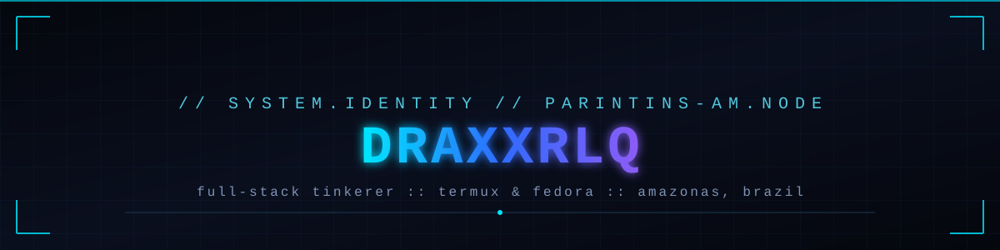
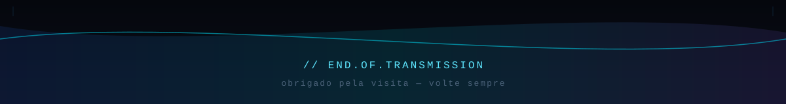

<div align="center">




</div>

<br/>

<div align="center">


</div>


## `> SOBRE O OPERADOR`

<table>
<tr>
<td width="60%" valign="top">

```yaml
operador:
  alias: jota
  base: parintins, amazonas - brasil
  ocupacao: estudante · desenvolvedor autodidata
  ambientes: [termux/android, fedora linux]
  linguas: [pt-br, en]
  interesses:
    - automação e bots (node.js, baileys)
    - visão computacional (mediapipe)
    - eletrônica DIY / hardware tinkering
    - dados abertos e educação (IBGE/SIDRA)
  filosofia: "construir em cima do que já quebrou uma vez"
```

gosto de pegar uma ideias como bot de whatsapp, um filtro de webcam, um app de quiz, essas coisas

</td>
<td width="40%" valign="top" align="center">



</td>
</tr>
</table>


## `> STACK TECNOLOGICA`

<div align="center">

### ⚙️ linguagens &amp; runtime


### 🧠 frameworks &amp; libs


### 🖥️ sistemas &amp; ferramentas


</div>



## `> RADAR DE HABILIDADES`

<table>
<tr>
<td width="50%" align="center">



</td>
<td width="50%" valign="top">

**leitura do radar**

| setor | foco atual |
|---|---|
| 🟢 `automação` | bots whatsapp de uso pessoal, agendamento de rotinas |
| 🟣 `visão computacional` | filtros por gesto com mediapipe hands |
| 🟡 `dados` | tratamento de bases IBGE/SIDRA para trabalhos escolares |
| 🔵 `sistemas` | termux ARM64, chroot, LUKS, diagnóstico de armazenamento |

> o radar não busca dominar tudo - ele mapeia onde estou investindo tempo *agora*.

</td>
</tr>
</table>


## `> LOG DE BOOT`

<div align="center">

</div>


## `> PROJETOS EM EXECUCAO`

<table>
<tr>
<td width="50%" valign="top">

### 🤖 `zap-bot`
bot pessoal de whatsapp construído com **Node.js** + **Baileys**, rodando sobre **Termux**. Comandos sem prefixo, respostas em minúsculo, mensagens automáticas de aniversário, api de IA e fazer figurinhas, integração com a API do iTunes para prévias de música.

`node` `baileys` `termux` `cron`

</td>
<td width="50%" valign="top">

### ✋ `hand-gesture-filters`
projeto em **JavaScript** com **MediaPipe Hands**: aplica filtros visuais dentro da área formada pelos dedos em tempo real, direto na webcam do navegador.

`javascript` `mediapipe` `canvas`

</td>
</tr>
<tr>
<td width="50%" valign="top">

### 🧩 `quiz-app`
app de quiz em **React Native** (Expo Snack), tela de login animada com **Moti** e glassmorphism, estrutura modular (`Quiz.js`, `Login.js`, `Botao.js`) e apresentação gerada em `.pptx` com tema dark de editor de código.

`react-native` `expo` `moti`

</td>
<td width="50%" valign="top">

### 🌾 `amazonas-em-dados`
material educacional sobre produções regionais do Amazonas (mandioca, açaí, pesca, pecuária, cheia sazonal), com gráficos, mapas e infográfico gerados a partir de dados oficiais do IBGE/SIDRA.

`python` `dados-abertos` `ibge`

</td>
</tr>
</table>


## `> METRICAS DO SISTEMA`

<div align="center">


</div>

<details>
<summary><b>📈 gráfico de atividade</b></summary>
<br/>

</details>


## `> COBRA DE CONTRIBUICOES`

<div align="center">

<picture>
  <source media="(prefers-color-scheme: dark)" srcset="assets/snake-dark.svg"/>
  <source media="(prefers-color-scheme: light)" srcset="assets/snake.svg"/>
  
</picture>

<sub>gerada automaticamente por <code>.github/workflows/snake.yml</code> — atualiza todo dia às 05:00 UTC</sub>

</div>


## `> CANAL DE COMUNICACAO`

<div align="center">

[](https://wa.me/5592992104311)
[](https://github.com/draxxrlq)
[](mailto:juancezar54@gmail.com)

</div>



<div align="center">
<sub>...</sub>
</div>
